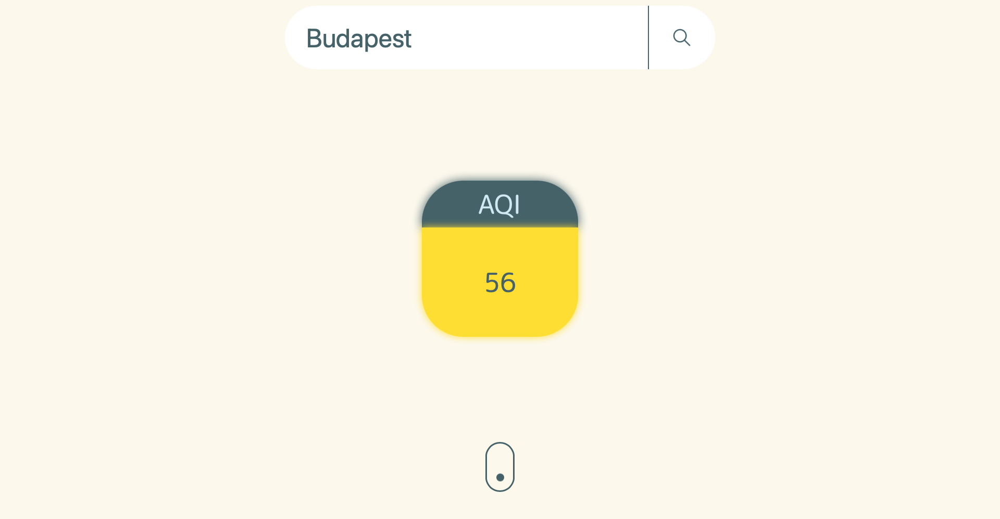

# Simple Air Quality Application by Bálint Berente
Get the current Air Quality Index (AQI) and gas amount for the city you want! The app saves your last successful query to your browser's local storage.
We do NOT collect any data from you!

Try it here: [SimpleAQI](http://aqi.berente.net)



Data is provided by: [Aqicn.org](https://aqicn.org/) via their API.

## Current issues
- There aren't AQI stations in every city, therefore the app might fail to get information for some cities.
- Only letters from the English alphabet can be processed in the query.
- Cities with multiple AQI stations are not handled correctly, api.waqi.info may be giving the main station (?).

## Config required
```
{
    "token": <your API token>,
    "url": "https://api.waqi.info/feed/",
    "server_port": <server port of your choice>
}
```
